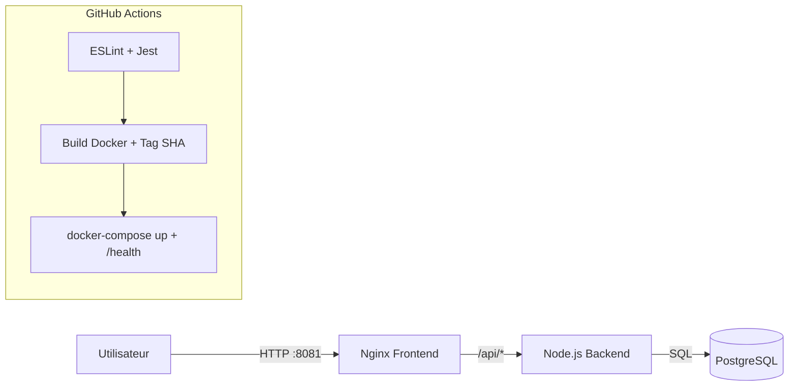

# VitalSync — Projet DevOps / CI-CD conteneurisé (EFREI)

Ce dépôt contient une chaîne DevOps complète (Docker, CI/CD GitHub Actions, Kubernetes) autour d’une application volontairement simple mais production-ready :
- **Backend** : Node.js (Express)
- **Frontend** : HTML statique servi par **Nginx** (reverse-proxy `/api`)
- **Base de données** : PostgreSQL

> Choix technique : j’ai gardé un scope applicatif minimal (healthchecks + DB check + métriques) pour concentrer l’épreuve sur la qualité DevOps (conteneurisation, CI/CD, déploiement, supervision).

---

## Architecture

- Le navigateur appelle le frontend (Nginx)
- Nginx sert `index.html` et proxifie `/api/*` vers le backend
- Le backend expose des endpoints:
  - `GET /health` (probe Kubernetes)
  - `GET /api/health` (probe via Nginx)
  - `GET /api/db-check` (validation PostgreSQL)
  - `GET /metrics` (exposition Prometheus)

### Schéma Mermaid



---

## Partie 1 — Git (Gitflow + Conventional Commits)

### Stratégie Gitflow

- `main` : branche stable (release)
- `develop` : intégration continue (toutes les features mergées ici)
- `feature/*` : branches de travail courtes, rebasées/mergées vers `develop`

> Justification : Gitflow clarifie le cycle de vie (feature → develop → main) et colle parfaitement à une évaluation CI/CD (pipelines différents selon les branches).

### `.gitignore` (choix)

Le fichier `.gitignore` exclut : `node_modules`, logs, coverage, fichiers `.env` et artefacts build.

> Justification : je ne versionne ni dépendances, ni secrets, ni artefacts générés (réduit la taille du repo et limite les fuites d’informations).

### Exemples de commits Conventional Commits

- `feat(backend): add /api/db-check endpoint`
- `fix(frontend): proxy /api to backend correctly`
- `chore(ci): add docker build and healthcheck stage`
- `test(backend): add health endpoint tests`

> Justification : un historique lisible aide la review, l’automatisation (release notes) et les correctifs ciblés.

---

## Partie 2 — Docker

### Backend (multi-stage)

- **Stage test** : installe, lance ESLint + Jest (qualité “shift-left”)
- **Stage prod** : image minimale avec dépendances `--omit=dev`

> Justification : je bloque le build si la qualité échoue et je réduis la surface d’attaque / taille d’image en prod.

### Frontend (Nginx)

- Sert un `index.html`
- Reverse-proxy `/api/*` → `backend:3000`

> Justification : Nginx est robuste et standard pour servir du statique + proxy (cache/headers possibles si besoin).

### Docker Compose

Services : `postgres`, `backend`, `frontend`.
- **Réseau custom** : `vitalsync-net`
- **Volume persistant** : `vitalsync-pgdata`
- Variables injectées via `.env`

> Justification : Compose permet de reproduire la stack identique en local et en CI (intégration rapide et fiable).

---

## Lancer en local (Docker)

```bash
cd vitalsync
cp .env.example .env
docker compose up -d --build
```

Vérifications :
- Frontend : http://localhost:8081
- Health (via proxy) : http://localhost:8081/api/health
- DB check : http://localhost:8081/api/db-check

Stop :
```bash
docker compose down -v
```

---

## Partie 3 — CI/CD (GitHub Actions)

Workflow : `.github/workflows/ci.yml`

### Triggers

- `push` sur `develop`
- `pull_request` vers `main`

### Étape 1 — Qualité

- `npm ci`
- `ESLint`
- `Jest`

> Justification : je valide le code avant toute construction d’image (moins de temps perdu et feedback rapide).

### Étape 2 — Build & Push Docker

- Build `backend` + `frontend`
- Tag **SHA** + `latest`
- Push sur **GHCR**

> Justification : le tag SHA garantit la traçabilité (même image = même commit), `latest` simplifie les démos Kubernetes.

### Étape 3 — Test d’intégration Compose

- `docker compose up -d --build`
- `curl http://localhost:8081/api/health`
- échec pipeline si KO

> Justification : je teste la stack “comme en prod” (réseau + proxy + dépendances), pas seulement des tests unitaires.

---

## Partie 4 — Kubernetes

Manifests dans `k8s/` :
- `deployment.yaml` : backend (2 replicas) + frontend
- `service.yaml` : services ClusterIP
- `ingress.yaml` : routage `/` et `/api`
- `secret.yaml` : mot de passe DB

> Justification : j’utilise un `Secret` Kubernetes pour ne jamais commiter de credentials et je configure liveness/readiness pour un déploiement résilient.

### Déploiement

```bash
cd vitalsync
kubectl apply -f k8s/secret.yaml
kubectl apply -f k8s/deployment.yaml
kubectl apply -f k8s/service.yaml
kubectl apply -f k8s/ingress.yaml
```

Notes :
- L’image pointe sur `ghcr.io/ilyesse-soc/...:latest` (à adapter si besoin)
- Postgres n’est pas déployé ici (souvent géré via StatefulSet ou DB managée). Le service `vitalsync-postgres` sert de DNS attendu côté backend.

---

## Partie 5 — Supervision (Prometheus / Grafana / ELK)

### Prometheus (collecte)

- **Infrastructure** : métriques CPU/RAM via `kube-state-metrics` + `node-exporter` (ou métriques du cluster selon l’environnement)
- **Conteneurs** : `cadvisor` (si disponible) pour l’usage CPU/RAM par container
- **Applicatif** : exposition d’un endpoint `/metrics` côté backend (format Prometheus) pour latence, nombre de requêtes, erreurs

> Justification : combiner métriques infra + applicatives permet d’expliquer un incident (ex: CPU ok mais latence élevée → DB/IO/erreurs applicatives).

### Grafana (visualisation)

Dashboards recommandés :
- CPU/RAM par namespace/pod
- Latence HTTP (p50/p95/p99)
- Taux d’erreurs (5xx)
- Requêtes/s

> Justification : Grafana centralise les KPI, facilite la lecture et accélère le diagnostic.

### ELK (logs)

- **Filebeat** : collecte logs pods
- **Elasticsearch** : indexation
- **Kibana** : exploration, requêtes, dashboards

Logs utiles :
- logs Nginx (codes HTTP)
- logs backend (erreurs 5xx)
- logs DB (slow queries si activé)

> Justification : les logs complètent les métriques (on trouve la cause exacte : stacktrace, endpoint fautif, payload, etc.).

---

## Partie 6 — Commandes Git (push projet)

```bash
git init
git add .
git commit -m "chore: init vitalsync devops stack"

git branch -M main
git checkout -b develop

git remote add origin https://github.com/Ilyesse-soc/VitalSync.git

git push -u origin main
git push -u origin develop
```

Exemple Gitflow :
```bash
git checkout develop
git checkout -b feature/ci-healthcheck
# ... changements ...
git commit -m "chore(ci): add compose healthcheck stage"
git push -u origin feature/ci-healthcheck
# puis PR vers develop
```
